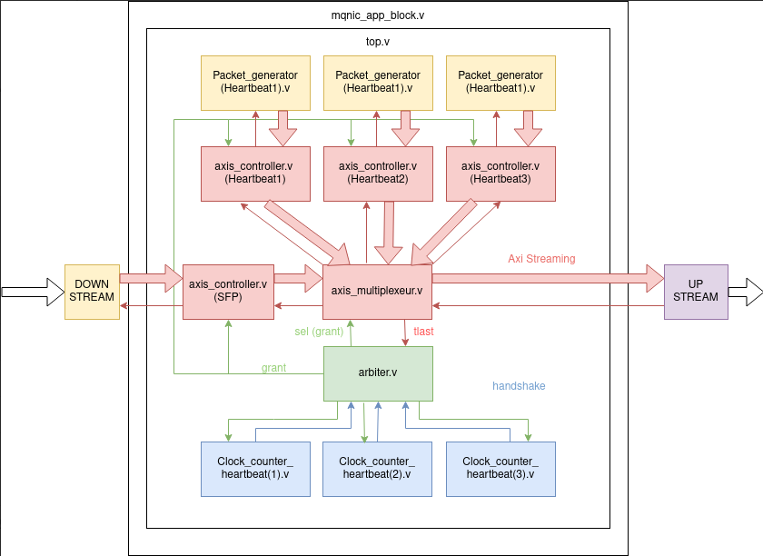
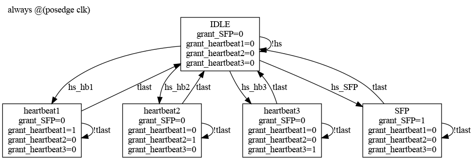

# Heartbeat Documentation

The aim of implementing this module is to experiment with the Corundum block app and provide insights for future development.

**Objective:** Implement a module within the Corundum app block that allows for the sending of forged packets directly into the FPGA's application block at regular intervals, while managing the arbitration of different sources and packets transiting through Corundum.

**Status:** Functional with default parameters.

## System Diagrams

()

## Different Modules

###[top_heartbeat.v](rtl/top_heartbeat.v)

- Instantiates all intra and extra-module signals and manages all system parameters that are transmitted by propagation.

## Parameters

### AXI Streaming Interface
- Used in: mqnic_app_block.v, top_heartbeat.v, axis_simple_controller.v, axis_multiplexeur.v, Packet_generator.v
  - IF_COUNT: Number of interfaces.
  - AXIS_DATA_WIDTH: Data bus width.
  - AXIS_KEEP_WIDTH: Validity bit corresponding to each byte of the data bus.
  - AXIS_RX_USER_WIDTH
  - AXIS_RX_ID_WIDTH

### Clock Counter Parameter
- Used in: Clock_counter.v
  - CLK_FRE: Clock frequency used.
  - X_MS: Millisecond threshold for the counter.
  - COUNTER_WIDTH

### Packet Generator Parameter
- Used in: packet_generator.v

###[Arbiter_module.v](rtl/Arbiter_module.v)
- Manages the prioritization of sources, implemented as a state machine.
- In our case, the priority order is heartbeat1, heartbeat2, heartbeat3, and the card stream.

()

###[Axis_multiplexeur.v](rtl/Axis_multiplexeur.v)
- Switches the source currently speaking, thanks to the arbiter.

###[Clock_counter.v](rtl/Clock_counter.v)
- Generates the handshake for the heartbeats.

###[Packet_generator.v](rtl/Packet_generator.v)
- Generates an Ethernet packet from registers (using parameters for now).

###[Axis_simple_controller.v](rtl/Axis_simple_controller.v)
- Manages the transmission and reception of different sources.

()

