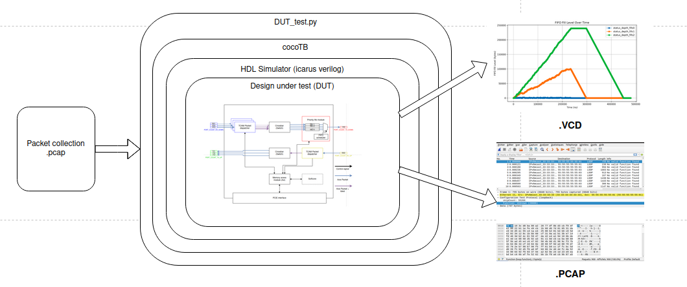

# Description

The implemented toolchain is designed to automate the process of simulating hardware designs. Its primary use is to send packet collections to the design under test and allows for the analysis of internal signals and scheduled packets.

## Contents of this directory:

1. A Python script for test automation.
2. A Makefile for using cocotb and integrating sources.
3. A folder containing packet collections.
4. A packet collection generator.

## Required system packages:

- Python 3 (python or python3, depending on distribution)
- Icarus Verilog (iverilog)
- GTKWave (gtkwave)

## Required Python packages:

- cocotb
- cocotb-bus
- cocotb-test
- cocotbext-axi
- cocotbext-eth
- cocotbext-pcie
- pytest
- scapy

## Usage

You can use the Python script `packet_collection_generator.py` as needed to generate packet collections. The default operation generates three packet collections corresponding to the three RX ports. The generated packets are of random size and content, except for the src Mac and Dest Mac addresses. The value of Mac Dest is processed in our DUT and affects FIFO allocation and whether the packet is dropped.

- "55:55:55:55:55:03": 25, # High fifo priority
- "55:55:55:55:55:02": 25, # Medium fifo priority
- "55:55:55:55:55:01": 25, # Low fifo priority
- "random": 25 # Drop packets

The src Mac value indicates the port number (most significant byte) and the sending order on this port (least significant bytes).

Once the packets are generated, they can be sent to the inputs of the design under test wrapper by modifying the paths in `test_wrapper_sim_only.py`:

- filepath_rx1 = 'set_packets/input_packets_port1.pcap'
- filepath_rx2 = 'set_packets/input_packets_port2.pcap'
- filepath_rx3 = 'set_packets/input_packets_port3.pcap'

To start the simulation, run the Makefile with the command `make` to generate an output pcap and the corresponding .vcd files for the internal signals. By default, the "status_depth" signals of the FIFOs are monitored and graphed in `status_depth_evolution.png`.
